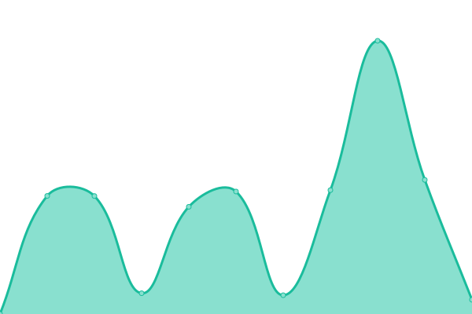

# [📈 Live Status](https://demo.upptime.js.org): <!--live status--> **🟩 All systems operational**

This repository contains the open-source uptime monitor and status page for [Mauricio Bessón](https://demo.upptime.js.org), powered by [Upptime](https://github.com/upptime/upptime).

With [Upptime](https://upptime.js.org), you can get your own unlimited and free uptime monitor and status page, powered entirely by a GitHub repository. We use [Issues](https://github.com/mauribesson/upptime/issues) as incident reports, [Actions](https://github.com/mauribesson/upptime/actions) as uptime monitors, and [Pages](https://demo.upptime.js.org) for the status page.

<!--start: status pages-->
<!-- This summary is generated by Upptime (https://github.com/upptime/upptime) -->
<!-- Do not edit this manually, your changes will be overwritten -->
<!-- prettier-ignore -->
| URL | Status | History | Response Time | Uptime |
| --- | ------ | ------- | ------------- | ------ |
|  [VQ PROD AR](http://demoarg.sidesys.com.ar/virtualqueue/index.html) | 🟩 Up | [vq-prod-ar.yml](https://github.com/mauribesson/upptime/commits/HEAD/history/vq-prod-ar.yml) | 

 426ms
     
 | 

<a href="https://mauribesson.github.io/upptime/history/vq-prod-ar">100.00%</a>
    

|  [VQ PROD RD](http://demord.sidesys.com.do:8080/virtualqueue/index.html) | 🟩 Up | [vq-prod-rd.yml](https://github.com/mauribesson/upptime/commits/HEAD/history/vq-prod-rd.yml) | 

 430ms
     
 | 

<a href="https://mauribesson.github.io/upptime/history/vq-prod-rd">100.00%</a>
    

|  [VQ PROD MX](http://demomx.sidesys.com.mx/virtualqueue/index.html) | 🟩 Up | [vq-prod-mx.yml](https://github.com/mauribesson/upptime/commits/HEAD/history/vq-prod-mx.yml) | 

 369ms
     
 | 

<a href="https://mauribesson.github.io/upptime/history/vq-prod-mx">100.00%</a>
    

|  [VQ PROD SV](http://demolatam.sidesys.com.ar/VirtualQueue_SV/index.html) | 🟩 Up | [vq-prod-sv.yml](https://github.com/mauribesson/upptime/commits/HEAD/history/vq-prod-sv.yml) | 

 624ms
     
 | 

<a href="https://mauribesson.github.io/upptime/history/vq-prod-sv">100.00%</a>
    

|  [VQ PROD GT](http://demolatam.sidesys.com.ar/VirtualQueue_GT/index.html) | 🟩 Up | [vq-prod-gt.yml](https://github.com/mauribesson/upptime/commits/HEAD/history/vq-prod-gt.yml) | 

 165ms
     
 | 

<a href="https://mauribesson.github.io/upptime/history/vq-prod-gt">100.00%</a>
    

|  [VQ PROD CR](http://democr.sidesys.co.cr/virtualqueue/index.html) | 🟩 Up | [vq-prod-cr.yml](https://github.com/mauribesson/upptime/commits/HEAD/history/vq-prod-cr.yml) | 

 1163ms
     
 | 

<a href="https://mauribesson.github.io/upptime/history/vq-prod-cr">100.00%</a>
    

|  [API transact - PROD](https://transact.prod.api.eflow.com.ar/swagger) | 🟩 Up | [api-transact-prod.yml](https://github.com/mauribesson/upptime/commits/HEAD/history/api-transact-prod.yml) | 

 233ms
     
 | 

<a href="https://mauribesson.github.io/upptime/history/api-transact-prod">15.82%</a>
    

|  [API ticket - PROD](https://ticket.prod.api.eflow.com.ar/swagger) | 🟩 Up | [api-ticket-prod.yml](https://github.com/mauribesson/upptime/commits/HEAD/history/api-ticket-prod.yml) | 

 236ms
     
 | 

<a href="https://mauribesson.github.io/upptime/history/api-ticket-prod">16.52%</a>
    

|  [API auth - PROD](https://auth.prod.api.eflow.com.ar/swagger) | 🟩 Up | [api-auth-prod.yml](https://github.com/mauribesson/upptime/commits/HEAD/history/api-auth-prod.yml) | 

 248ms
     
 | 

<a href="https://mauribesson.github.io/upptime/history/api-auth-prod">15.76%</a>
    

|  [API appointment - PROD](https://appointment.prod.api.eflow.com.ar/swagger) | 🟩 Up | [api-appointment-prod.yml](https://github.com/mauribesson/upptime/commits/HEAD/history/api-appointment-prod.yml) | 

 409ms
     
 | 

<a href="https://mauribesson.github.io/upptime/history/api-appointment-prod">14.22%</a>
    

|  [API announcement - PROD](https://announcement.prod.api.eflow.com.ar/swagger) | 🟩 Up | [api-announcement-prod.yml](https://github.com/mauribesson/upptime/commits/HEAD/history/api-announcement-prod.yml) | 

 253ms
     
 | 

<a href="https://mauribesson.github.io/upptime/history/api-announcement-prod">12.62%</a>
    

|  [API transact - TEST](http://52.154.219.177/swagger) | 🟩 Up | [api-transact-test.yml](https://github.com/mauribesson/upptime/commits/HEAD/history/api-transact-test.yml) | 

 122ms
     
 | 

<a href="https://mauribesson.github.io/upptime/history/api-transact-test">72.06%</a>
    

|  [API ticket - TEST](http://20.118.2.237/swagger) | 🟩 Up | [api-ticket-test.yml](https://github.com/mauribesson/upptime/commits/HEAD/history/api-ticket-test.yml) | 

 125ms
     
 | 

<a href="https://mauribesson.github.io/upptime/history/api-ticket-test">72.07%</a>
    

|  [API auth - TEST](http://20.118.2.6/swagger) | 🟩 Up | [api-auth-test.yml](https://github.com/mauribesson/upptime/commits/HEAD/history/api-auth-test.yml) | 

 115ms
     
 | 

<a href="https://mauribesson.github.io/upptime/history/api-auth-test">72.07%</a>
    

|  [API appointment - TEST](http://20.118.0.8/swagger) | 🟩 Up | [api-appointment-test.yml](https://github.com/mauribesson/upptime/commits/HEAD/history/api-appointment-test.yml) | 

 136ms
     
 | 

<a href="https://mauribesson.github.io/upptime/history/api-appointment-test">72.08%</a>
    

|  [API announcement - TEST](http://13.86.127.46/swagger) | 🟩 Up | [api-announcement-test.yml](https://github.com/mauribesson/upptime/commits/HEAD/history/api-announcement-test.yml) | 

 138ms
     
 | 

<a href="https://mauribesson.github.io/upptime/history/api-announcement-test">71.51%</a>
    

<!--end: status pages-->

[**Visit our status website →**](https://demo.upptime.js.org)

## 📄 License

- Powered by: [Upptime](https://github.com/upptime/upptime)
- Code: [MIT](./LICENSE) © [Mauricio Bessón](https://demo.upptime.js.org)
- Data in the `./history` directory: [Open Database License](https://opendatacommons.org/licenses/odbl/1-0/)
