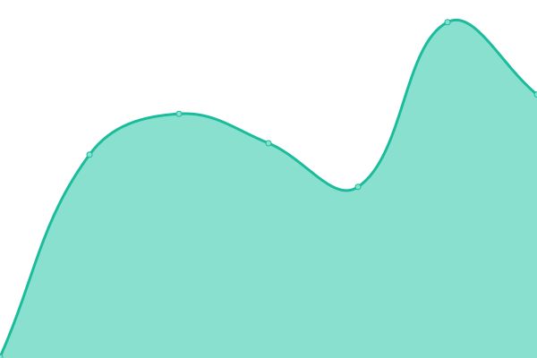
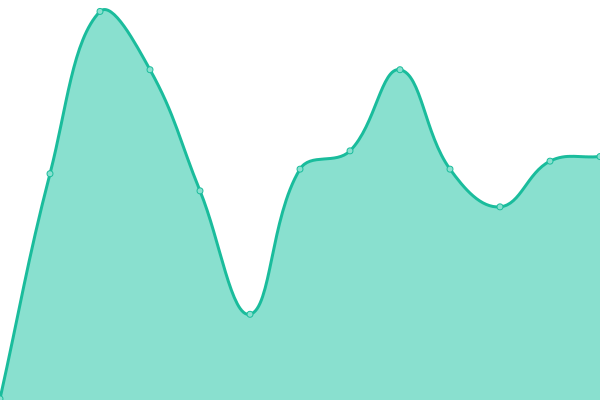

# [📈 Live Status](https://demo.upptime.js.org): <!--live status--> **🟧 Partial outage**

This repository contains the open-source uptime monitor and status page for [Mauricio Bessón](https://demo.upptime.js.org), powered by [Upptime](https://github.com/upptime/upptime).

With [Upptime](https://upptime.js.org), you can get your own unlimited and free uptime monitor and status page, powered entirely by a GitHub repository. We use [Issues](https://github.com/mauribesson/upptime/issues) as incident reports, [Actions](https://github.com/mauribesson/upptime/actions) as uptime monitors, and [Pages](https://demo.upptime.js.org) for the status page.

<!--start: status pages-->
<!-- This summary is generated by Upptime (https://github.com/upptime/upptime) -->
<!-- Do not edit this manually, your changes will be overwritten -->
<!-- prettier-ignore -->
| URL | Status | History | Response Time | Uptime |
| --- | ------ | ------- | ------------- | ------ |
|  [VQ PROD AR](https://demoarg.sidesys.com.ar/virtualqueue/index.html) | 🟥 Down | [vq-prod-ar.yml](https://github.com/mauribesson/upptime/commits/HEAD/history/vq-prod-ar.yml) | 

 3708ms
     
 | 

<a href="https://mauribesson.github.io/upptime/history/vq-prod-ar">0.00%</a>
    

|  [VQ PROD CO](https://demord.sidesys.com.do/virtualqueue_CO/index.html) | 🟥 Down | [vq-prod-co.yml](https://github.com/mauribesson/upptime/commits/HEAD/history/vq-prod-co.yml) | 

 3676ms
     
 | 

<a href="https://mauribesson.github.io/upptime/history/vq-prod-co">0.00%</a>
    

|  [VQ PROD MX](https://demomx.sidesys.com.mx/virtualqueue/index.html) | 🟥 Down | [vq-prod-mx.yml](https://github.com/mauribesson/upptime/commits/HEAD/history/vq-prod-mx.yml) | 

 3653ms
     
 | 

<a href="https://mauribesson.github.io/upptime/history/vq-prod-mx">0.00%</a>
    

|  [VQ PROD SV](https://demolatam.sidesys.com.ar/VirtualQueue_SV/index.html) | 🟥 Down | [vq-prod-sv.yml](https://github.com/mauribesson/upptime/commits/HEAD/history/vq-prod-sv.yml) | 

 3737ms
     
 | 

<a href="https://mauribesson.github.io/upptime/history/vq-prod-sv">0.00%</a>
    

|  [VQ PROD GT](https://demolatam.sidesys.com.ar/VirtualQueue_GT/index.html) | 🟥 Down | [vq-prod-gt.yml](https://github.com/mauribesson/upptime/commits/HEAD/history/vq-prod-gt.yml) | 

 3661ms
     
 | 

<a href="https://mauribesson.github.io/upptime/history/vq-prod-gt">0.00%</a>
    

|  [VQ PROD CR](https://democr.sidesys.co.cr/virtualqueue/index.html) | 🟥 Down | [vq-prod-cr.yml](https://github.com/mauribesson/upptime/commits/HEAD/history/vq-prod-cr.yml) | 

 3673ms
     
 | 

<a href="https://mauribesson.github.io/upptime/history/vq-prod-cr">0.00%</a>
    

|  [API transact - PROD](https://transact.prod.api.eflow.com.ar/swagger) | 🟥 Down | [api-transact-prod.yml](https://github.com/mauribesson/upptime/commits/HEAD/history/api-transact-prod.yml) | 

 0ms
     
 | 

<a href="https://mauribesson.github.io/upptime/history/api-transact-prod">0.00%</a>
    

|  [API ticket - PROD](https://ticket.prod.api.eflow.com.ar/swagger) | 🟥 Down | [api-ticket-prod.yml](https://github.com/mauribesson/upptime/commits/HEAD/history/api-ticket-prod.yml) | 

 0ms
     
 | 

<a href="https://mauribesson.github.io/upptime/history/api-ticket-prod">0.00%</a>
    

|  [API auth - PROD](https://auth.prod.api.eflow.com.ar/swagger) | 🟥 Down | [api-auth-prod.yml](https://github.com/mauribesson/upptime/commits/HEAD/history/api-auth-prod.yml) | 

 0ms
     
 | 

<a href="https://mauribesson.github.io/upptime/history/api-auth-prod">0.00%</a>
    

|  [API appointment - PROD](https://appointment.prod.api.eflow.com.ar/swagger) | 🟥 Down | [api-appointment-prod.yml](https://github.com/mauribesson/upptime/commits/HEAD/history/api-appointment-prod.yml) | 

 0ms
     
 | 

<a href="https://mauribesson.github.io/upptime/history/api-appointment-prod">0.00%</a>
    

|  [API announcement - PROD](https://announcement.prod.api.eflow.com.ar/swagger) | 🟥 Down | [api-announcement-prod.yml](https://github.com/mauribesson/upptime/commits/HEAD/history/api-announcement-prod.yml) | 

 0ms
     
 | 

<a href="https://mauribesson.github.io/upptime/history/api-announcement-prod">0.00%</a>
    

|  [VQ Chatbot PROD RD BANCO](https://chatbot-prod.sidesys.com.ar/VQ_Banco_Chatbot_PROD/index.html) | 🟩 Up | [vq-chatbot-prod-rd-banco.yml](https://github.com/mauribesson/upptime/commits/HEAD/history/vq-chatbot-prod-rd-banco.yml) | 

 707ms
     
 | 

<a href="https://mauribesson.github.io/upptime/history/vq-chatbot-prod-rd-banco">98.99%</a>
    

|  [VQ Chatbot PROD RD HOSPITAL](https://chatbot-prod.sidesys.com.ar/VQ_Hospital_Chatbot_PROD/index.html) | 🟩 Up | [vq-chatbot-prod-rd-hospital.yml](https://github.com/mauribesson/upptime/commits/HEAD/history/vq-chatbot-prod-rd-hospital.yml) | 

 653ms
     
 | 

<a href="https://mauribesson.github.io/upptime/history/vq-chatbot-prod-rd-hospital">99.04%</a>
    

|  [VQ Chatbot PROD RD MUNICIPALIDAD](https://chatbot-prod.sidesys.com.ar/VQ_Municipalidad_Chatbot_PROD/index.html) | 🟩 Up | [vq-chatbot-prod-rd-municipalidad.yml](https://github.com/mauribesson/upptime/commits/HEAD/history/vq-chatbot-prod-rd-municipalidad.yml) | 

 612ms
     
 | 

<a href="https://mauribesson.github.io/upptime/history/vq-chatbot-prod-rd-municipalidad">99.09%</a>
    

<!--end: status pages-->

[**Visit our status website →**](https://demo.upptime.js.org)

## 📄 License

- Powered by: [Upptime](https://github.com/upptime/upptime)
- Code: [MIT](./LICENSE) © [Mauricio Bessón](https://demo.upptime.js.org)
- Data in the `./history` directory: [Open Database License](https://opendatacommons.org/licenses/odbl/1-0/)
